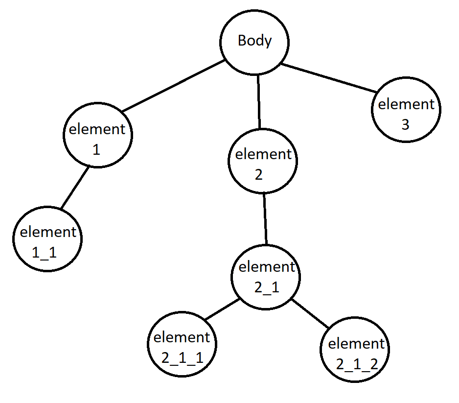
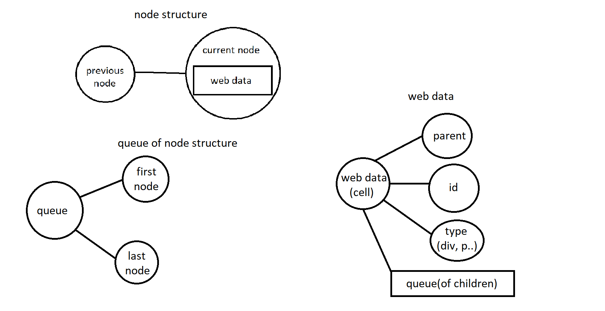
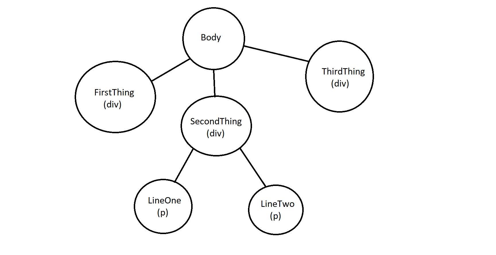

# web-tree-builder
This is web page building program without gui. The web page is structured in the memory as a tree. When you write compile and hit enter the HTML and CSS files will be generated for you.

# Memory Structure
This is how the HTML tree is structured.



This is how a node of the HTML Tree is structured.



# Commands(the most important ones)
```
create type_of_element(div, p, h1, etc.) id_of_element
```

Creates a node with the specified type(type_of_element) and id(id_of_element)

```
select id_of_element
```

Selects the element with specific id(id_of_element) so you can edit it

```
delete id_of_element
```

Deletes the element with specific id(id_of_element) and it's related elements.

```
compile
```

Generates HTML and CSS files.

```
compilefile "file_path"
````

Generates HTML and CSS files with commands from a file.

```
help
```

Displays all of the commands/functions of the web-tree-builder.

#Example

Tree structure of the HTML



input code:

```
create div FirstThing
create div SecondThing
create div SomethingThing
select SecondThing
create p LineOne
create p LineTwo
```

HTML Code after "compilation":

```
<!DOCTYPE html>
<html>
<head>
	<title>RandomPage</title>
	<link rel="stylesheet" href="style.css">
</head>

<body id="Body">
	<div id="FirstThing">
	</div>
	<div id="SecondThing">
		<p id="LineOne">
		</p>
		<p id="LineTwo">
		</p>
	</div>
	<div id="SomethingThing">
	</div>
</body>
</html>
```

CSS Code after "compilation":

```
#FirstThing
{
}
#LineOne
{
}
#LineTwo
{
}
#SecondThing
{
}
#SomethingThing
{
}
#Body
{
}
```
